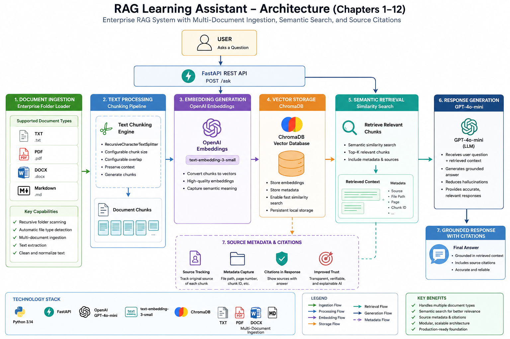
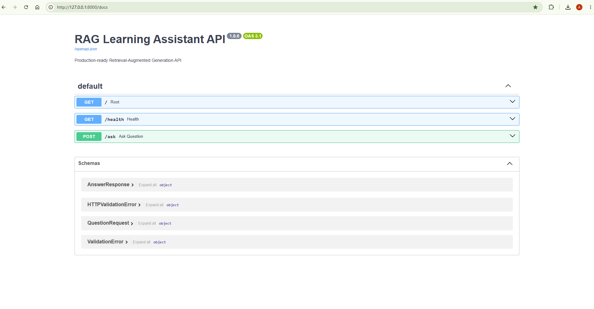

# RAG Learning Assistant

Production-grade Retrieval-Augmented Generation (RAG) application built with FastAPI, OpenAI Embeddings, ChromaDB, and GPT-4o-mini.

This project demonstrates how modern AI systems combine semantic search, vector databases, and large language models to deliver grounded and context-aware answers from custom knowledge sources.

Designed as an enterprise-style AI Engineering project for scalable educational and knowledge retrieval applications.

## System Architecture




## Project Status

**Current Version:** v1.2

### Completed

-  FastAPI REST API
-  Retrieval-Augmented Generation (RAG)
-  OpenAI Embeddings
-  ChromaDB Vector Database
-  Multi-document Ingestion
-  Source Metadata & Citations
-  Enterprise Folder Loader
-  TXT Support
-  PDF Support
-  DOCX Support
-  Markdown Support

### Next Milestones

- Hybrid Search
- Conversation Memory
- Streaming Responses
- Authentication
- Docker Deployment


## Overview

Traditional Large Language Models generate responses based only on their training data.

Retrieval-Augmented Generation (RAG) enhances LLMs by retrieving relevant information from external documents before generating a response.

This project allows users to:

* Upload documents
* Convert documents into embeddings
* Store embeddings in ChromaDB
* Perform semantic search
* Retrieve relevant context
* Generate grounded answers using GPT-4o-mini

The result is a more accurate and reliable AI assistant that can answer questions based on specific knowledge sources.


## Architecture

```text
                 Documents
       (TXT • PDF • DOCX • MD)
                    │
                    ▼
         Enterprise Folder Loader
                    │
                    ▼
              Text Extraction
                    │
                    ▼
             Automatic Chunking
                    │
                    ▼
            OpenAI Embeddings
                    │
                    ▼
             Chroma Vector DB
                    │
                    ▼
             Semantic Retrieval
                    │
                    ▼
            FastAPI RAG Endpoint
                    │
                    ▼
               GPT-4o-mini
                    │
                    ▼
             Grounded Response
```

## Features

## Features

-  Retrieval-Augmented Generation (RAG)
-  FastAPI REST API
-  OpenAI Embeddings
-  ChromaDB Vector Database
-  Semantic Search
-  Multi-document Ingestion
-  Source Metadata & Citations
-  Automatic Text Chunking
-  Enterprise Folder Loader
-  Modular Document Loaders
-  Automatic File Type Detection
-  Support for TXT, PDF, DOCX, and Markdown
-  Production-ready Project Structure


## Technology Stack

### Backend

- Python 3.14
- FastAPI
- Uvicorn

### AI

- OpenAI API
- GPT-4o-mini
- text-embedding-3-small

### Vector Database

- ChromaDB

### Document Processing

- TXT
- PDF (pypdf)
- DOCX (python-docx)
- Markdown (markdown + BeautifulSoup)

### Development

- Git
- GitHub
- VS Code


## Supported Document Types

| Document Type | Supported |
|--------------|-----------|
| TXT | ✅ |
| PDF | ✅ |
| DOCX | ✅ |
| Markdown | ✅ |


## Project Structure

RAG-Learning-Assistant/

├── app/

│   ├── api/

│   ├── config/

│   ├── embeddings/

│   ├── ingestion/

│   ├── llm/

│   ├── retrieval/

│   └── models/

│

├── scripts/

├── data/

├── main.py

├── requirements.txt

└── README.md


## Installation

Clone the repository:

git clone https://github.com/aramradif/RAG-Learning-Assistant.git

Navigate into the project:

cd RAG-Learning-Assistant

Create a virtual environment:

python -m venv .venv

Activate:

Windows:

.venv\Scripts\activate

Install dependencies:

pip install -r requirements.txt


## Running the API

## API Documentation

The application includes interactive Swagger UI documentation.



Start FastAPI:

uvicorn main:app --reload

Open Swagger UI:

http://127.0.0.1:8000/docs


## Example Request

POST /ask

Request:

{
"question": "What is RAG?"
}

Response:

{
"answer": "RAG combines semantic search with large language models to provide grounded answers based on external documents."
}


## Roadmap

### Completed

-  FastAPI Backend
-  ChromaDB Integration
-  Semantic Search
-  Multi-document Ingestion
-  Source Metadata & Citations
-  PDF Support
-  DOCX Support
-  Markdown Support

### Planned

- Hybrid Search (Semantic + Keyword)
- Conversational Memory
- Streaming Responses
- Authentication & Authorization
- Docker & Containerization
- CI/CD Pipeline
- Cloud Deployment (AWS / Azure)
- Evaluation Framework
- Agentic Workflows
- Multi-Agent Orchestration


